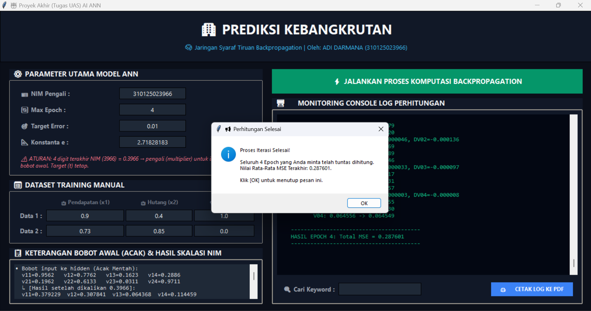

# 🏢 Aplikasi Prediksi Kebangkrutan - JST Backpropagation

Aplikasi berbasis Desktop GUI menggunakan Python dan Tkinter untuk mensimulasikan proses komputasi algoritma **Jaringan Syaraf Tiruan (JST) Backpropagation** langkah demi langkah secara real-time. Proyek ini dibuat untuk memenuhi Tugas Proyek Akhir (UAS) mata kuliah Kecerdasan Buatan / *Artificial Neural Network* (ANN).

---

## 🚀 Fitur Utama

* **Komputasi Otomatis Berbasis NIM:** Skalasi otomatis nilai input data dan bobot awal acak berdasarkan 4 digit terakhir NIM pengguna (*multiplier*).
* **Log Perhitungan Detail:** Menampilkan visualisasi langkah demi langkah proses *Forward Pass* (Hidden & Output Layer), kalkulasi *Error/MSE*, hingga *Backward Pass* (Koreksi Delta & Update Bobot).
* **Konstanta Euler Dinamis:** Nilai eksponen $e$ (Sigmoid) yang dapat dikustomisasi langsung melalui antarmuka GUI.
* **Fitur Pencarian Log:** Mempermudah pencarian kata kunci tertentu (seperti data ke-n atau epoch ke-n) di dalam konsol monitoring.
* **Ekspor Laporan ke PDF:** Cetak salinan log perhitungan yang rapi dan terstruktur langsung ke dalam format `.pdf` melalui pustaka ReportLab.
* **Antarmuka Modern Dark Mode:** Tampilan GUI yang bersih, responsif, dan nyaman dipandang menggunakan skema warna tema gelap (*slate/dark theme*).

---

## 📸 Tampilan Aplikasi

Berikut adalah visualisasi antarmuka aplikasi dengan tata letak dual-panel yang proporsional:



1.  **Panel Kiri:** Parameter Utama ANN (NIM, Max Epoch, Target Error, Konstanta e), Input Dataset Manual (Pendapatan $x_1$, Hutang $x_2$, Target $t$), dan Tabel Preview Bobot Awal Terkalibrasi.
2.  **Panel Kanan:** Tombol Eksekusi, Monitor Console Log Perhitungan Utama, Pencarian Kata Kunci, dan Fitur Cetak PDF.

---

## 🛠️ Persyaratan Sistem

Sebelum menjalankan aplikasi, pastikan Anda telah menginstal komponen berikut:
* **Python 3.8** atau versi yang lebih baru.
* Sistem Operasi yang mendukung GUI Tkinter (Windows, macOS, Linux).

### Dependensi Pihak Ketiga:
* `numpy` (Untuk operasi manipulasi array/matriks matematika).
* `reportlab` (Untuk generator berkas dokumen PDF laporan).

---

## 📦 Cara Instalasi dan Menjalankan

1.  **Clone atau Unduh Repositori Ini:**
    ```bash
    git clone [https://github.com/USERNAME_ANDA/REPOSITORI_ANDA.git](https://github.com/USERNAME_ANDA/REPOSITORI_ANDA.git)
    cd REPOSITORI_ANDA
    ```

2.  **Instalasi Dependensi:**
    Gunakan `pip` untuk menginstal seluruh pustaka eksternal yang tertera pada file `requirements.txt`:
    ```bash
    pip install -r requirements.txt
    ```

3.  **Jalankan Aplikasi:**
    Eksekusi berkas skrip Python utama untuk membuka antarmuka GUI:
    ```bash
    python main.py
    ```
    *(Catatan: Sesuaikan nama file `.py` jika Anda mengubah namanya).*

---

## 🧮 Alur Perhitungan Algoritma

Aplikasi ini menggunakan arsitektur jaringan standar dengan **2 Input Nodes**, **4 Hidden Nodes**, dan **1 Output Node** ($2 \rightarrow 4 \rightarrow 1$).

### 1. Fungsi Aktivasi Sigmoid
Fungsi aktivasi yang digunakan pada hidden layer dan output layer adalah fungsi Sigmoid Biner:
$$y = \frac{1}{1 + e^{-x}}$$

### 2. Aturan Multiplier NIM
Bobot mentah acak ($v, v_0, w, w_0$) dan input data akan dikalikan dengan konstanta pengali (*multiplier*) berupa pecahan desimal dari 4 angka terakhir NIM Anda:
$$\text{Multiplier} = 0.\text{[4 Digit Terakhir NIM]}$$

### 3. Kriteria Berhenti (*Stopping Condition*)
Proses iterasi pelatihan (*training*) akan otomatis berhenti jika:
1.  Jumlah iterasi telah mencapai batas maksimum parameter **Max Epoch**, ATAU
2.  Nilai rata-rata Mean Squared Error (**Total MSE**) telah lebih kecil atau sama dengan **Target Error** yang ditentukan.

---

## 👥 Kontributor

* **Nama:** ADI DARMANA  
* **NIM:** 310125023966  
* **Status Proyek:** Tugas Akhir / Proyek UAS Artificial Intelligence (ANN)
